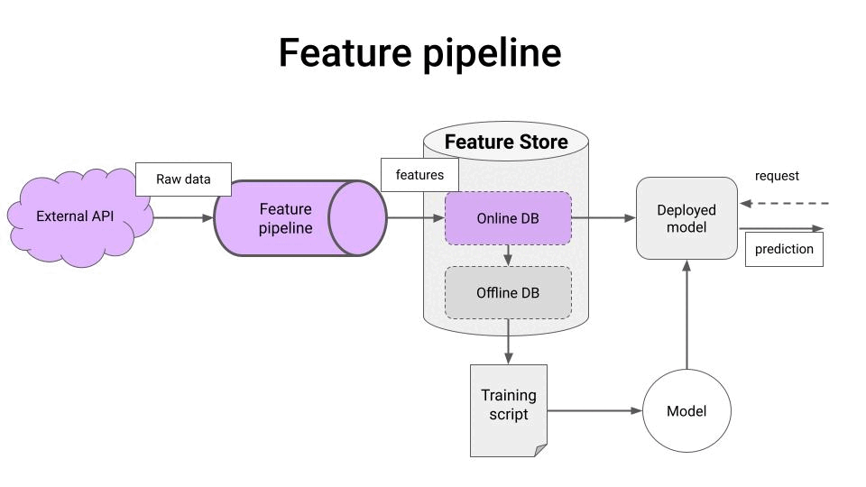
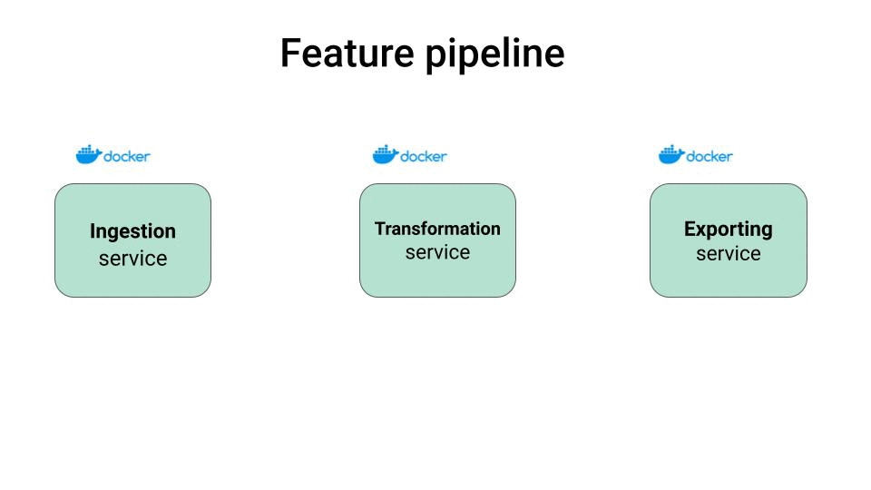
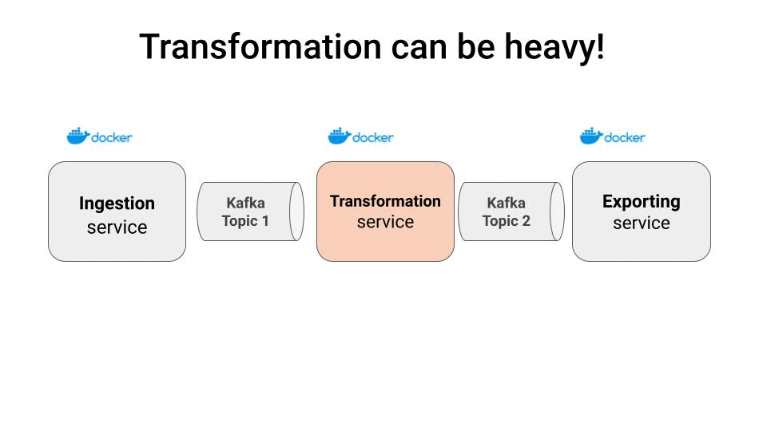

<div align="center">
    <a href='https://www.realworldml.xyz/'></a>    
</div>

<div align="center">
    <h1>Build and deploy a production-ready real-time feature pipeline in Python</h1>
    <h2>Apache Kafka + Python = <a href="https://github.com/quixio/quix-streams">Quix Streams</a> ❤️</h2>
    
</div>

<div align="center">
  <a href="https://www.youtube.com/watch?v=JMQwXmlloJM">
    
    <p>Click here to watch the video 🎬</p>
  </a>
</div>


#### Table of contents
* [The problem](#the-problem)
* [Example](#example)
* [Run the pipeline locally](#run-the-pipeline-locally)
* [Deployment](#deployment)
* [Wanna learn more real-time ML?](#wanna-learn-more-real-time-ml)


## The problem

Imagine you want to build a trading bot for crypto currencies using ML.

Before you even get to work on your ML model, you need to design, develop and deploy a **real-time feature pipeline** that produces the features your model needs both at training time and at inference time.

<div align="center">
    
</div>

This pipeline has 3 steps:

- **Ingest** raw data from an external service, like raw trades from the Kraken Websocket API.

- **Transform** these trades into features for your ML model, like trading indicators based on 1-minute OHLC candles, and

- **Save** these features in a Feature Store, so your ML models can fetch them both to generate training data, and to generate real-time predictions.

In a real-world setting, each of these steps is implemented as a separate service, and communication between these services happens through a message broker like Kafka.

<div align="center">
    
</div>

This way you make your system scalable, by spinning up more containers as needed, and leveraging Kafka consumer groups.

<div align="center">
    
</div>

And this is all great, but the question now is
> How do you implement this in practice?

Let's go through an example.

## Example

In this repo you have a full implementation of a production-ready real-time feature pipeline for crypto trading, plus a real-time [dasbhoard to visualize these features](https://streamlit-plabartabajo-ohlcinrealtime-production.deployments.quix.io/).

We use [Quix Streams 2.0](https://github.com/quixio/quix-streams) a cloud native library for processing data in Kafka using pure Python.

With Quix Streams we get the best from both worlds:

- low-level scalability and resiliency from Apache Kafka, so our code is production-ready from day 1, and

- an easy-to-use Python interface, which makes this library extremely user-friendly for Data Scientist and ML engineers like you and me.


In this repository we have implemented 3 services for our real-time pipeline

- `trade_producer` → reads trades from the Kraken Websocket API and saves them in a Kafka topic.
- `trade_to_ohlc` → reads trades from Kafka topic, computes Open-High-Low-Close candles (OHLC) using Stateful Window Operators, and saves them in another Kafka topic.

- `ohlc_to_feature_store` → saves these final features to an external Features Store.

Plus a

- Streamlit `dashboard` to visualize the saved features in real-time.

The final pipeline has been deployed to the [Quix Cloud](https://quix.io/), as well as the [Streamlit dashboard](https://streamlit-plabartabajo-ohlcinrealtime-production.deployments.quix.io/).


## Run the pipeline locally

1. Create an `.env` file and fill in the credentials to connect to the serverles Hopsworks Feature Store
    ```
    $ cp .env.example .env
    ```

2. Build Docker image for each of the pipeline steps: `trade_producer`, `trade_to_ohlc` and `ohlc_to_feature_store`
    ```
    $ make build
    ```

3. Start the pipeline
    ```
    $ make start
    ```

3. Stop the pipeline locally
    ```
    $ make stop
    ```

## Deployment

This pipeline can run on any production environment that supports Docker and a message broker like Apache Kafka or Redpanda. In this example, I have deployed it to Quix Cloud.

>[Quix Cloud](https://quix.io/) provides fully managed containers, Kafka and observability tools to run your applications in production.

To deploy this pipeline to the [Quix Cloud]() you just need to

- [Sign up for FREE](https://quix.io/)
- Create a Quix Cloud Project and an environment, and
- Fork this repository and link it to your newly created Quix Cloud environment.

> [This video](https://quix.io/docs/create/overview.html#next-step) will help you get up and running on Quix Cloud


## Wanna learn more real-time ML?

Join more than 11k subscribers to the Real-World ML Newsletter. Every Saturday morning.

[→ Subscribe for FREE 🤗](https://www.realworldml.xyz/subscribe)