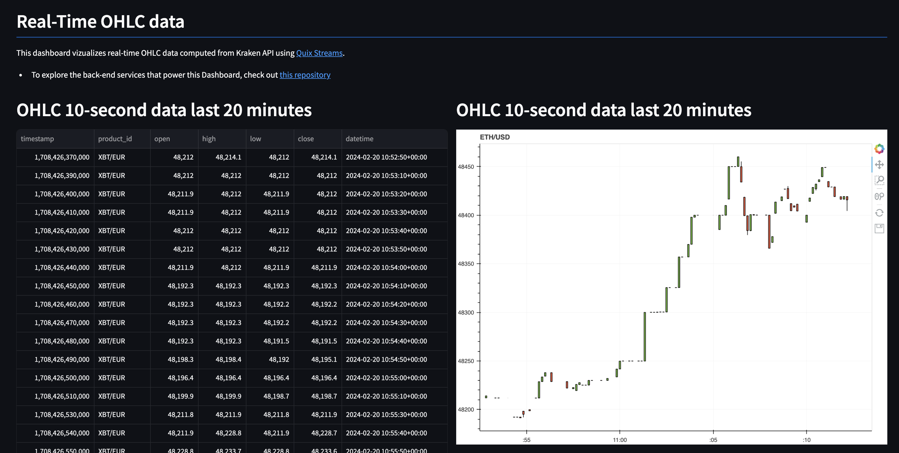

<div align="center">
    <a href='https://www.realworldml.xyz/'></a>    
</div>

<div align="center">
    <h1>Build and deploy a production-ready dashboard</h1>
    <h2>Streamlit + Docker = ❤️</h2>
    
</div>

<div align="center">
  <a href="https://dashboard-plabartabajo-ohlcinrealtime-production.deployments.quix.io/">
    
    <p>Click here to see it in action ⚡</p>
  </a>
</div>

## Run the dashboard locally

1. Create an `.env` file and fill in the credentials to connect to the serverles Hopsworks Feature Store
    ```
    $ cp .env.example .env
    ```

2. Build Docker image
    ```
    $ make build
    ```

3. Run the dockerized dashboard
    ```
    $ make run
    ```
